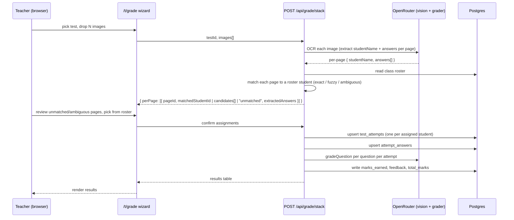

# feat: Teacher-first experience — stack grading + onboarding hook

## Overview

Three intertwined product moves, planned together because they share the same architectural seams:

1. **Split teacher and student into separate route-level experiences.** Today the entire app lives in `app/page.tsx` (~2,400 lines) and a role toggle decides what to render. Replace this with `/t` (teacher) and `/s` (student) route groups, each with its own layout, header, and navigation. `/` becomes a marketing/onboarding surface for signed-out users, and a redirect (to `/t` or `/s`) for signed-in users.

2. **Polish the teacher's auto-grading flow into a "Stack-and-Grade" wizard.** The teacher's home becomes "Grade a stack": pick a test → drop N images of handwritten papers → backend splits pages by student (using a name detected on each page, fallback to roster picker for ambiguous pages) → OCR + AI-grade in one operation → results table. Teacher-driven attempt creation removes today's hard requirement that a student must have submitted online before OCR can run. The student experience is reduced to a minimal "your tests + your grades" page.

3. **Apply the onboarding-conversion playbook** to a pre-auth teacher funnel. A signed-out visitor can paste one answer key + drop one student paper and see one real AI grade *before* signing up. State is held in a localStorage vault and synced into a real class on auth. Auth uses loss-aversion copy ("Don't lose your first graded test"). No paywall is in scope.

The student experience is intentionally a thin slice. Most of the work — and most of the polish — lives in the teacher path.

## Problem Frame

**Teacher pain (today):**

- Grading a stack of handwritten papers requires every student to have already submitted *something* online: the OCR endpoint at `app/api/ocr/route.ts` keys off an existing `attemptId`, which only exists once a `test_attempts` row is inserted by the student. If a class never submitted online, the teacher cannot use OCR at all.
- For each student, the teacher must (a) find the attempt row in a list of opaque IDs (`student_id.slice(0, 12)…`), (b) expand a collapsed "Upload handwritten answers" link, (c) pick files, (d) click Run OCR, (e) click AI Grade. Five interactions per student.
- OCR matches student answers to questions by *normalized prompt string*. If a paper writes "Q1." instead of the full prompt, matching silently fails. There is no UI to inspect or repair the match.
- Teacher and student share a single-page UI with a role-switch toggle, which leaks complexity in both directions and makes the teacher path feel like a tool drawer rather than a focused product.

**Onboarding pain (today):**

- The signed-out landing is a generic "AI grading assistant" pitch with three icon cards and two CTAs to sign in. There is no concrete taste of what the product does, no commitment device, and no emotional hook. Conversion depends entirely on the user being already-sold.

**Goals:**

- Teacher's grading workflow: one screen, one stack of papers, one button → graded results.
- Student experience exists, but is small and stays out of the teacher's way.
- Signed-out teachers can experience one full grading cycle before being asked to sign up; the act of typing an answer key and dropping a paper is the commitment device.

## Requirements Trace

- R1. A teacher can upload a stack of handwritten papers for a test and reach a graded results screen without manually creating per-student rows beforehand.
- R2. The OCR pipeline detects the student's name on each page and assigns each page to a roster member, with a roster-picker fallback for ambiguous or missing names.
- R3. The teacher path lives at routes under `/t/...` with its own layout. The student path lives at routes under `/s/...` with its own layout. Neither path renders the other's chrome.
- R4. A signed-in user is auto-routed to `/t` or `/s` from `/` based on `app_users.role`.
- R5. The student experience contains, at minimum, a list of their tests and a per-test grade view. No teacher controls bleed in.
- R6. Signed-out visitors see an onboarding sequence applying the playbook patterns (emotional hook, capability cards, commitment device, reflection, loss-aversion auth, social proof). At least one full grading cycle (paste answer key + upload one paper + see one grade) is completable pre-auth.
- R7. Pre-auth grading state persists across screen transitions and the auth redirect via a localStorage vault, and is synced into a real class on first sign-in.
- R8. The grading wizard surfaces extracted answers per question per student and lets the teacher repair the question-to-answer match before grading commits.
- R9. The change does not regress today's per-student grading path; it remains accessible as a fallback for one-off re-grades.

## Scope Boundaries

**In scope:**

- New `/t` and `/s` route groups, role-based redirect from `/`, and decomposition of `app/page.tsx` into route-scoped components.
- New "Stack-and-Grade" wizard at `/t/grade` (or `/t` as the teacher home).
- New `POST /api/grade/stack` endpoint that owns the page-split → OCR → attempt-create → grade chain.
- Extension of OCR to extract a per-page student name and a per-page question/answer set.
- Roster endpoint and roster-picker UI for ambiguous matches.
- Teacher-driven attempt creation (server-side, no student involvement).
- Pre-auth onboarding vault, public single-paper grading endpoint, screen sequence, loss-aversion auth copy, post-auth sync.
- Funnel analytics events with literal per-screen names.

**Out of scope (explicit non-goals):**

- Paywall, billing, subscription. The funnel ends at "save your progress → auth → first real class".
- Gradebook export, CSV download, LMS integration. The user has confirmed teachers have their own grade-input process.
- Fixing pre-existing TypeScript errors in `app/api/`.
- Mobile-specific redesign beyond the responsive pieces already present.
- Multi-page-per-student PDF parsing (assume the upload is one image == one page; a single student may span multiple pages, but each page is a separate image upload).
- Replacing Clerk or changing the auth provider.
- Reworking the question bank / class / test creation flows beyond what the wizard needs inline.

## Context & Research

### Relevant Code and Patterns

- `app/page.tsx` — single 2,415-line client component holding all role-conditional UI; the source of today's role-toggle UX. Will be decomposed.
- `app/layout.tsx` — root layout with header, ClerkProvider, and shared chrome. Will need conditional/per-route variants.
- `app/api/ocr/route.ts` — current OCR endpoint. Receives `attemptId` + `images`, calls `extractHandwrittenAnswers`, normalizes prompts, upserts `attempt_answers` keyed on attempt+question. Pattern to mirror for the new stack endpoint.
- `app/api/grade/route.ts` and `app/api/grade/batch/route.ts` — single and batch grading endpoints. Both call `gradeOneAttempt` from `lib/grading.ts`. The stack endpoint will compose these primitives.
- `app/api/submissions/route.ts` — currently the only path that creates `test_attempts` rows, and it's `requireRole("student")`. We need a teacher-side equivalent (`requireRole("teacher")` + `requireClassAccess`).
- `lib/openrouter.ts` — `extractHandwrittenAnswers(images)` returns `OcrAnswer[]`. We will extend this (or add a sibling function) to also return a per-page student-name guess.
- `lib/grading.ts` — `gradeOneAttempt(attemptId, testId)` is the unit of grading; reusable for the stack flow.
- `lib/auth.ts` — `requireRole`, `requireClassAccess`, `getCurrentUser`. The role-redirect on `/` will use `getCurrentUser` server-side.
- `drizzle/schema.ts` — schema is rich enough to support teacher-driven attempts without changes. `class_memberships` already enumerates students-in-class; that is the roster.
- `app/api/classes/[classId]/members/` — already returns class members; the wizard will reuse it.

### Institutional Learnings

No prior `docs/solutions/` exist in this repo. Onboarding-conversion patterns are sourced from `/Users/davidmackay/dev/onboarding-conversion-playbook.md` (referenced by the user) and applied verbatim where the persona maps cleanly.

### External References

- The onboarding-conversion playbook (Zumi Friendship CRM, distilled 2026-04-26): the 21-step funnel template, the four enabling architecture patterns (pre-auth vault, single idempotent sync, routing intercept on `/`, literal funnel event names).
- Next.js App Router route groups: `app/(marketing)/...`, `app/(teacher)/t/...`, `app/(student)/s/...` is the pattern that gives each cohort its own layout without leaking into the URL.
- Clerk Next.js redirect-after-sign-in: `<SignInButton fallbackRedirectUrl="/t" />` and the `redirectUrl` query param survive the modal flow.

## Key Technical Decisions

- **Route groups for separation, not subdomains.** `app/(teacher)/t/...` and `app/(student)/s/...` give each role its own layout file (header, sidebar, theming). The URL is the source of truth for role context, which simplifies the layout tree and makes the two experiences independently iteratable. Subdomains were considered and rejected — they add deployment and auth-cookie complexity for no UX gain.
- **Server-side role redirect from `/` for signed-in users.** Implemented in a server component at `app/page.tsx` (or `app/(marketing)/page.tsx` after restructure) using `auth()` from Clerk + a single DB read. Avoids a client-side flicker between the marketing surface and the role's home.
- **Stack-and-Grade is a single endpoint, not a client orchestration.** `POST /api/grade/stack` accepts `testId + images[] + (optional) page→studentId overrides` and runs OCR → page-split → attempt-create → grade in one server transaction per student. The client polls or streams progress. This keeps the grading pipeline atomic and lets us reason about idempotency in one place.
- **Page-to-student matching is OCR-first, roster-second, manual-third.** OCR returns a `studentName` guess per page. The server normalizes and matches against the class roster (`class_memberships` joined to `app_users.full_name`). Unmatched or ambiguous pages return to the wizard for manual roster-picker assignment before grading commits.
- **Teacher-driven attempts use the same `test_attempts` table.** No new table. Teacher-uploaded attempts get `status = "submitted"` and `submitted_at = now()` when the OCR completes, matching how today's student-submitted attempts behave. This means the existing batch-grade endpoint and submissions list keep working unchanged.
- **Pre-auth vault is localStorage-only and per-device.** No anonymous server-side persistence. The vault holds `{ answerKey, studentPaperImage(base64), graderResult, completedAt }` under a single key. The vault is drained on first authenticated dashboard load and turned into a starter class.
- **Public pre-auth grade endpoint is stateless.** `POST /api/onboarding/sample-grade` accepts a single image + a single answer key + marks, calls OCR + `gradeQuestion`, returns the result. No DB writes. Rate-limited by IP/Clerk-fingerprint to prevent abuse.
- **Funnel events use literal names.** Per the playbook: `onboarding_emotional_hook`, `onboarding_capabilities`, `onboarding_answer_key`, `onboarding_paper_upload`, `onboarding_first_grade`, `onboarding_save_progress`, `onboarding_auth_complete`, `onboarding_class_synced`. Fired on screen entry, deduped per session.
- **Existing single-attempt OCR endpoint stays.** `POST /api/ocr` remains for the per-attempt fallback flow (R9). The new stack endpoint is additive.

## Open Questions

### Resolved During Planning

- **Where does the teacher land after sign-in?** The Stack-and-Grade wizard at `/t/grade`. If the teacher has zero classes, the wizard's first step ("pick a test") guides them through inline class + test creation. Resolved by making `/t/grade` the canonical teacher home and treating `/t` as a redirect to `/t/grade` (or `/t/onboarding-sync` if there's a vault to drain).
- **Do we need a new DB table for "teacher-uploaded attempts"?** No. `test_attempts` already supports it; the only change is which API path creates the row. Resolved by sharing the table.
- **Is the pre-auth grade hosted by OpenRouter directly from the browser, or via the server?** Server. The API key cannot ship to the client. Resolved.
- **Does the student vault item ever get associated with a real student (i.e., can the pre-auth paper become an attempt of a real class member after sync)?** No, not in this plan. The pre-auth grade is a "sample" — on sync it materializes as a starter class with one test, one question, one mock student named "Sample student" so the teacher can see what a real graded result looks like inside the app. Real grading begins on subsequent uploads.

### Deferred to Implementation

- Exact page-to-student matching tolerance (Levenshtein threshold, name-token overlap heuristic). Resolved at implementation time after seeing real OCR variance.
- Whether to stream stack-grade progress via SSE or to poll a job row. Decision lands when implementing Unit 7; SSE is preferred but pollable status fits with current Next.js route conventions.
- Whether to gate the public sample-grade endpoint behind a Turnstile/reCAPTCHA token. Implementer will assess actual abuse signals before adding friction.
- Final filename for the decomposed components from `app/page.tsx`. Likely `components/teacher/*` and `components/student/*`, but exact splits emerge as the file is broken up.

## High-Level Technical Design

> *This illustrates the intended approach and is directional guidance for review, not implementation specification. The implementing agent should treat it as context, not code to reproduce.*

### Route tree after restructure

```
app/
  layout.tsx                        ← top-level ClerkProvider only; chrome moves into per-group layouts
  page.tsx                          ← server component; redirects signed-in users by role, otherwise renders marketing
  (marketing)/
    layout.tsx                      ← marketing chrome (translucent header, sign-in CTA)
    onboarding/
      hook/page.tsx                 ← step 1: emotional hook
      capabilities/page.tsx         ← step 2: 3-card capabilities
      answer-key/page.tsx           ← step 3: paste answer key (commitment device part 1)
      upload/page.tsx               ← step 4: drop one paper (commitment device part 2)
      result/page.tsx               ← step 5: reflection — show graded result
      save/page.tsx                 ← step 6: loss-aversion → auth
  (teacher)/
    layout.tsx                      ← teacher chrome (sidebar, class selector, indigo theme)
    t/
      page.tsx                      ← redirect to /t/grade (or /t/onboarding-sync)
      grade/page.tsx                ← Stack-and-Grade wizard (PRIMARY ENTRY POINT)
      classes/page.tsx              ← classes list + invites
      classes/[classId]/page.tsx    ← class detail (questions, tests, students)
      onboarding-sync/page.tsx      ← post-auth vault drain (one-time)
  (student)/
    layout.tsx                      ← student chrome (lighter, stripped down)
    s/
      page.tsx                      ← list of tests + grades
      tests/[testId]/page.tsx       ← per-test detail / take / view grade
  api/
    ...                             ← unchanged routes
    grade/
      stack/route.ts                ← NEW: stack-and-grade endpoint
    onboarding/
      sample-grade/route.ts         ← NEW: public, stateless, rate-limited
      sync/route.ts                 ← NEW: drain vault into a real class
    classes/
      [classId]/roster/route.ts     ← NEW: scoped roster (id, name) for the wizard
    submissions/
      teacher-attempt/route.ts      ← NEW: teacher creates an attempt for a student
```

### Stack-and-Grade flow (wizard + endpoint)



### Onboarding funnel (pre-auth → auth → first class)

```mermaid
flowchart LR
  hook[1. Emotional hook<br/>"You spend nights grading"] --> caps[2. 3 capabilities<br/>Scan / Grade / Review]
  caps --> ak[3. Paste answer key<br/>commitment device pt1]
  ak --> up[4. Drop one paper<br/>commitment device pt2]
  up --> grade[5. Sample grade rendered<br/>reflection]
  grade --> save[6. Save your progress<br/>loss aversion]
  save --> auth[7. Clerk auth<br/>copy: "Don't lose your<br/>first graded test"]
  auth --> sync[8. /t/onboarding-sync<br/>vault drained → starter class]
  sync --> grade2[9. Land on /t/grade<br/>with sample test pre-populated]
```

### Pre-auth vault shape (localStorage)

```ts
// directional, not implementation
type OnboardingVault = {
  schemaVersion: 1;
  startedAt: string;       // ISO
  completedAt?: string;
  answerKey?: { prompt: string; correctAnswer: string; marks: number };
  studentPaper?: { mimeType: string; base64: string; filename: string };
  sampleGrade?: { marksEarned: number; maxMarks: number; feedback: string };
  syncedAt?: string;       // set after /api/onboarding/sync runs
};
const VAULT_KEY = "graider:onboarding:vault:v1";
```

## Implementation Units

The work is grouped into four phases. Phases 1–3 ship the teacher-first restructure and grading flow. Phase 4 ships the onboarding hook on top.

### Phase 1 — Route separation foundation

- [ ] **Unit 1: Introduce route groups for marketing, teacher, student**

**Goal:** Create the empty route shells and per-group layouts so subsequent units can fill them in. No behavior change yet — `/` still renders today's UI through a temporary passthrough.

**Requirements:** R3, R4

**Dependencies:** None

**Files:**
- Create: `app/(marketing)/layout.tsx`
- Create: `app/(teacher)/layout.tsx`
- Create: `app/(teacher)/t/page.tsx`
- Create: `app/(student)/layout.tsx`
- Create: `app/(student)/s/page.tsx`
- Modify: `app/layout.tsx` (strip per-role chrome down to ClerkProvider + html/body; chrome moves into group layouts)
- Modify: `app/page.tsx` (becomes a server component that branches: signed-out → marketing landing; signed-in teacher → redirect `/t`; signed-in student → redirect `/s`)
- Test: `app/__tests__/role-redirect.test.ts` (server component / route handler test)

**Approach:**
- Route groups in App Router: `(marketing)`, `(teacher)`, `(student)` — parens prevent the segment appearing in the URL.
- Each group's `layout.tsx` owns its own header, sidebar, background, and theming.
- `app/page.tsx` becomes a server component that calls `auth()` + `getCurrentUser()` and uses `redirect('/t')` or `redirect('/s')`. Signed-out path renders `<MarketingLanding />` directly so we avoid an extra hop.
- Temporary: `/t/page.tsx` and `/s/page.tsx` render simple "Teacher home — work in progress" / "Student home — work in progress" placeholders; the real content arrives in Units 7 and 9.

**Patterns to follow:**
- `app/layout.tsx` ClerkProvider wrapping pattern (preserve).
- The existing `lib/auth.ts` `getCurrentUser` for the redirect decision.

**Test scenarios:**
- Happy path: signed-out user hits `/` and gets the marketing landing.
- Happy path: signed-in user with `role=teacher` hits `/` and gets a 307/308 redirect to `/t`.
- Happy path: signed-in user with `role=student` hits `/` and gets a redirect to `/s`.
- Edge case: signed-in user with no `app_users` row yet (Clerk session present but DB sync not done) — `getCurrentUser` creates the row with default `role=student` and redirects to `/s`.
- Edge case: signed-in user hits `/t` directly with `role=student` — they get a redirect to `/s` (server-side guard in `(teacher)/layout.tsx`).
- Edge case: signed-in user hits `/s` with `role=teacher` — they get a redirect to `/t`.

**Verification:**
- Visiting `/` while signed out renders marketing copy.
- Visiting `/` while signed in redirects to the role-correct path within one network round trip.
- Cross-role direct URL access bounces to the correct role's home.

- [ ] **Unit 2: Decompose `app/page.tsx` into role-scoped components**

**Goal:** Break the 2,415-line monolith into smaller per-route components living under their route group. No behavior change beyond the routing — the same screens render, just from new file paths.

**Requirements:** R3

**Dependencies:** Unit 1

**Files:**
- Create: `app/(teacher)/t/classes/page.tsx`
- Create: `app/(teacher)/t/classes/[classId]/page.tsx`
- Create: `app/(student)/s/page.tsx` (replaces placeholder from Unit 1; lists tests + grades for the signed-in student)
- Create: `components/teacher/Sidebar.tsx`
- Create: `components/teacher/ClassSelector.tsx`
- Create: `components/teacher/QuestionsView.tsx`
- Create: `components/teacher/TestsView.tsx`
- Create: `components/teacher/StudentsView.tsx`
- Create: `components/teacher/InvitesPanel.tsx`
- Create: `components/student/TestList.tsx`
- Create: `components/student/AttemptDetailCard.tsx`
- Create: `components/shared/StatusBanner.tsx`
- Create: `components/shared/Card.tsx`
- Create: `components/shared/FormField.tsx`
- Create: `components/shared/icons.tsx` (move all the inline IconX components here)
- Create: `lib/dashboard-client.ts` (the `handleJson`, `setStatus`-style helpers extracted from `app/page.tsx`)
- Modify: `app/page.tsx` (now only does the role redirect from Unit 1)
- Delete: nothing yet — keep the original `app/page.tsx` content reachable via the new files until Unit 7 lands the wizard, then prune.

**Approach:**
- Mechanical extraction. Move JSX subtrees into named components, lift their state hooks to the page-level component, leave shared types in `lib/types.ts`.
- The role-toggle in the sidebar (`updateRole(...)`) moves into a small `components/shared/RoleSwitcher.tsx` that's only mounted in dev/teacher, and removed from the student layout entirely.
- Keep all existing API contracts. This unit is a refactor with zero behavior change.

**Execution note:** This is the largest pure refactor in the plan. Use a characterization-first approach — capture the rendered HTML for the four primary teacher views (classes, questions, tests, students) before refactoring (e.g., a snapshot test or a screenshot via Playwright) and confirm it matches after. Smaller, frequent commits per extracted component.

**Patterns to follow:**
- Component naming: PascalCase, one component per file, default-exported named function.
- Prop types co-located with the component.
- Existing class names (`btnPrimary`, `inputClass`) extracted into a shared `components/shared/styles.ts` to avoid duplication.

**Test scenarios:**
- Test expectation: characterization snapshots only. The acceptance criterion is "the rendered teacher and student dashboards look and behave identically to today across the existing flows: create class, invite, create question, create test, submit (student), grade attempt, OCR upload, batch grade." A few Playwright traces are sufficient.

**Verification:**
- Manual click-through of the existing teacher flow: create class → add questions → create test → grade attempt → OCR → batch grade. All work as before.
- Manual click-through of the existing student flow: join class → submit test → view grade. All work as before.

- [ ] **Unit 3: Add per-group layouts with distinct chrome**

**Goal:** Make `/t` and `/s` feel like different products. Teacher gets a sidebar layout, indigo theme, and rich navigation. Student gets a simpler top-nav layout with no sidebar, more whitespace, and reduced controls.

**Requirements:** R3, R5

**Dependencies:** Unit 2

**Files:**
- Modify: `app/(teacher)/layout.tsx` (sidebar shell, class selector, teacher header)
- Modify: `app/(student)/layout.tsx` (top-nav shell, no sidebar, no class selector)
- Modify: `app/(marketing)/layout.tsx` (transparent header, sign-in CTA)
- Modify: `app/layout.tsx` (remove the global header that's currently rendered for everyone — it moves into the group layouts)
- Modify: `components/shared/icons.tsx` (export the logo svg component used in the marketing header)

**Approach:**
- The existing global header in `app/layout.tsx` is split: marketing keeps a translucent variant; teacher gets a flat header with the active class label; student gets a minimal header with their name + sign-out.
- Each group layout server-side guards its own role: teacher layout calls `requireRole("teacher")` and redirects to `/s` on mismatch; student layout does the inverse.
- Theming stays unified visually (per the design system memory: indigo-600 primary, emerald CTA, light-violet bg) but the chrome density and information architecture diverge.

**Patterns to follow:**
- Existing color tokens from the design-system memory.
- Server-side `redirect()` from `next/navigation` for role guarding.

**Test scenarios:**
- Happy path: teacher visits `/t/grade` and sees the sidebar layout with class selector and teacher nav items.
- Happy path: student visits `/s` and sees the top-nav layout with no sidebar.
- Edge case: a teacher signed in and a student signed in see no shared chrome on their respective pages — sidebars, class selectors, and role-toggles do not bleed across.
- Error path: an unauthenticated request to `/t/...` redirects to `/`, which renders the marketing landing.

**Verification:**
- Visual diff of `/t/...` vs `/s/...` — they look like distinct products.
- DOM inspection: no `RoleSwitcher` rendered in the student layout. No teacher sidebar in the student layout.

### Phase 2 — Stack-and-Grade wizard

- [ ] **Unit 4: Roster endpoint + teacher-driven attempt creation**

**Goal:** Give the wizard the two server primitives it needs: (a) "what students are in this class" and (b) "create an attempt for student X on test Y, server-side, no student involvement."

**Requirements:** R1, R2

**Dependencies:** Unit 1

**Files:**
- Create: `app/api/classes/[classId]/roster/route.ts`
- Create: `app/api/submissions/teacher-attempt/route.ts`
- Modify: `lib/types.ts` (add `RosterEntry = { user_id, full_name, email }` and a teacher-attempt payload type)
- Test: `app/api/classes/[classId]/roster/__tests__/route.test.ts`
- Test: `app/api/submissions/teacher-attempt/__tests__/route.test.ts`

**Approach:**
- `GET /api/classes/[classId]/roster` returns active student memberships joined with `app_users.full_name`. Authorization: `requireClassAccess(classId, ["teacher"])`.
- `POST /api/submissions/teacher-attempt` accepts `{ testId, studentId }`, asserts the test belongs to a class the teacher manages, asserts the student is in that class, and inserts a `test_attempts` row with `status="submitted"` + `submitted_at=now()`. Returns `{ attempt_id }`. Idempotent: if an attempt for `(testId, studentId)` already exists, return its id.
- Idempotency unlocks safe retries from the wizard.

**Patterns to follow:**
- `app/api/grade/route.ts` error-handling pattern (try/catch + status mapping for `UNAUTHORIZED`/`FORBIDDEN`).
- `app/api/submissions/route.ts` for the attempt insert shape.
- `requireClassAccess(classId, ["teacher"])` from `lib/auth.ts`.

**Test scenarios:**
- Happy path: teacher of class C calls `GET /api/classes/C/roster` → receives all active students in C with names.
- Happy path: teacher creates an attempt for `(testId, studentId)` → receives `attempt_id`. Calling again returns the *same* `attempt_id` (idempotent).
- Edge case: empty class — roster returns `[]`, no error.
- Edge case: student already submitted online; teacher calls `teacher-attempt` for the same `(testId, studentId)` → returns the existing attempt id without overwriting.
- Error path: teacher of class A calls roster on class B → 403.
- Error path: a student calls either endpoint → 403.
- Error path: `studentId` not in class → 400 with a clear message.
- Integration scenario: roster call returns N students; calling `teacher-attempt` for each yields N distinct attempt ids; calling once more for any one returns the same id (no duplicates).

**Verification:**
- `class_memberships` and `test_attempts` rows behave as documented above when poked with `psql`.
- Rerunning `teacher-attempt` does not create duplicate rows.

- [ ] **Unit 5: Extend OCR to extract per-page student name + answers**

**Goal:** When OCR processes a stack of images, return a structured per-page payload that includes a guess at the student's name on each page, in addition to the current question/answer extraction.

**Requirements:** R2

**Dependencies:** None (pure backend change)

**Files:**
- Modify: `lib/openrouter.ts` (extend `extractHandwrittenAnswers` to return per-page data, or add a sibling `extractHandwrittenStack(images)`)
- Modify: `lib/types.ts` (add `OcrPage = { pageIndex, studentNameGuess, confidence, answers: OcrAnswer[] }`)
- Test: `lib/__tests__/openrouter.test.ts`

**Approach:**
- The OpenRouter prompt is updated to ask for: per page, the visible name at the top of the paper, plus the question/answer pairs. JSON shape becomes `{ pages: [{ studentName, confidence: 0..1, answers: [...] }] }`.
- Client-callable shape: `extractHandwrittenStack(images: ImagePayload[]): Promise<OcrPage[]>`.
- Keep `extractHandwrittenAnswers` as a thin wrapper that flattens for backward compatibility with the existing `/api/ocr` route.

**Patterns to follow:**
- `parseJsonPayload` and `callOpenRouter` already in `lib/openrouter.ts`.
- The existing JSON schema enforcement via `response_format: { type: "json_object" }`.

**Test scenarios:**
- Happy path: 3-image input → 3 `OcrPage` results; each has a `studentNameGuess` (possibly empty string) and `answers[]`.
- Edge case: image with no detectable name → `studentNameGuess: ""` and `confidence: 0`. The function does not throw.
- Edge case: image with messy multi-name header → returns the most-likely candidate with `confidence < 0.5`.
- Error path: OpenRouter returns malformed JSON → throws (consistent with today's behavior).
- Integration scenario: real fixture images of two different students return distinct `studentNameGuess` strings.

**Verification:**
- A unit test with a stubbed OpenRouter response asserts the parsed shape.
- A live smoke test (developer-run, not CI) with two real fixture images returns sensible names.

- [ ] **Unit 6: `POST /api/grade/stack` endpoint**

**Goal:** A single server endpoint that owns the full pipeline: image stack → per-page OCR → roster match → attempt creation → answer upsert → grade → return results.

**Requirements:** R1, R2, R8

**Dependencies:** Unit 4, Unit 5

**Files:**
- Create: `app/api/grade/stack/route.ts`
- Create: `lib/stack-grading.ts` (the orchestration function that the route delegates to, so it's testable in isolation)
- Modify: `lib/types.ts` (add `StackGradeRequest`, `StackPageResult`, `StackGradeResponse`)
- Test: `lib/__tests__/stack-grading.test.ts`
- Test: `app/api/grade/stack/__tests__/route.test.ts`

**Approach:**
- Endpoint shape: `POST /api/grade/stack` with multipart form-data: `testId`, `images[]`, plus an optional JSON `assignments` field for the second-pass call (page index → studentId overrides).
- Two-phase use:
  - **Phase A (preview):** client calls without `assignments`. Server runs OCR + roster matching, returns `{ pages: [{ pageIndex, ocrAnswers, candidates: { exact, fuzzy[], unmatched }, suggestedStudentId }] }`. No DB writes.
  - **Phase B (commit):** client calls with `assignments: { pageIndex: studentId }[]`. Server upserts attempts, upserts answers, runs `gradeOneAttempt` per attempt, returns the graded results table.
- Authorization: `requireRole("teacher")` + `requireClassAccess(testClassId, ["teacher"])`.
- Idempotency: phase B is keyed by `(testId, studentId)`. Re-running with the same assignments overwrites answers (not duplicates) and re-grades.
- Reuse `gradeOneAttempt` from `lib/grading.ts` unchanged.

**Patterns to follow:**
- `app/api/ocr/route.ts` for the multipart parsing + storage upload pattern.
- `app/api/grade/batch/route.ts` for the iterating-grade-then-aggregate pattern.

**Test scenarios:**
- Happy path (preview): teacher uploads 3 images, all pages have clear names that exactly match roster → response has 3 `suggestedStudentId`s, no `unmatched`.
- Happy path (commit): teacher confirms 3 assignments → server creates 3 attempts (or reuses), grades all 3, returns total/max marks for each.
- Edge case: 5 images, 1 page has no detected name → returned as `unmatched`, server does not auto-assign, no DB writes for that page.
- Edge case: 2 pages map to the same student (a long answer that wrapped) → server returns ambiguous; client must pick one or merge. (For this plan: treat as ambiguous and let the wizard ask the teacher.)
- Edge case: the same teacher re-uploads the same stack of 3 images → previously-graded attempts have their answers overwritten and re-graded; no duplicate rows.
- Error path: a teacher of class A submits with a `testId` belonging to class B → 403.
- Error path: a student calls the endpoint → 403.
- Error path: `testId` not found → 404.
- Error path: zero images → 400.
- Integration scenario: a 4-image stack (2 known students × 2 pages each is *not* in scope) — for now, integration test asserts that 4 distinct students from the same class can each be graded in one stack call.
- Integration scenario: phase B with stale `assignments` (a studentId that isn't in the class anymore) → 400 with clear message.

**Verification:**
- After a full call, the database has: 1 attempt row per assigned student, full answer rows, `total_marks`/`max_marks`/`graded_at` populated.
- Re-running the same call does not create duplicate rows.

- [ ] **Unit 7: Stack-and-Grade wizard UI at `/t/grade`**

**Goal:** The teacher's primary entry point. Three steps: (1) pick a test (or create inline), (2) drop a stack of images, (3) review per-page student matches and edit ambiguous/unmatched, (4) confirm → grade. Results render in-page.

**Requirements:** R1, R2, R8

**Dependencies:** Unit 6

**Files:**
- Create: `app/(teacher)/t/grade/page.tsx`
- Create: `components/teacher/grade-wizard/StepPickTest.tsx`
- Create: `components/teacher/grade-wizard/StepUploadStack.tsx`
- Create: `components/teacher/grade-wizard/StepReviewMatches.tsx`
- Create: `components/teacher/grade-wizard/StepResults.tsx`
- Create: `components/teacher/grade-wizard/RosterPicker.tsx`
- Create: `components/teacher/grade-wizard/use-stack-grade.ts` (custom hook owning the wizard state machine)
- Modify: `app/(teacher)/t/page.tsx` (redirect to `/t/grade` if classes exist; otherwise to `/t/classes` for first-time setup)
- Test: `components/teacher/grade-wizard/__tests__/use-stack-grade.test.ts`

**Approach:**
- Wizard state machine: `pickTest → uploadStack → reviewing → grading → results`. Backed by a custom hook so the steps stay declarative.
- Step 1 ("Pick a test"): a searchable dropdown of the teacher's tests across all their classes, with an inline "+ New test" affordance that pops a modal (reusing the existing test-creation API). Empty state — no classes yet — sends them to `/t/classes` with a banner.
- Step 2 ("Upload"): a large drop-zone (drag/drop + file picker), accepts JPG/PNG up to 10 images per call. Live thumbnails shown.
- Step 3 ("Review"): renders each page as a card: thumbnail on left, OCR'd answers on right, a roster picker pre-selected to `suggestedStudentId`. Cards with no suggestion are visually highlighted and sorted to the top. The "Grade all" button is disabled until every page has a chosen student (or is explicitly skipped).
- Step 4 ("Results"): a table per student, with marks, max marks, and a per-question expand-to-see-feedback. A "Grade another stack" CTA returns to step 1.
- Status indicator: the per-image status badges (queued / OCR'd / matched / graded / failed) update as the stack progresses. For v1, this is a simple polling loop over the response; SSE is deferred (see Open Questions).

**Patterns to follow:**
- Existing `Card`, `btnPrimary`, `btnSecondary`, `inputClass`, `Badge`, `SectionHeader` from `components/shared/*`.
- Existing class selector pattern in the teacher sidebar.

**Test scenarios:**
- Happy path: teacher picks a test, uploads 3 papers with clean names, confirms suggested matches, sees a results table with 3 rows.
- Edge case: teacher uploads 4 papers but the OCR can't read one name; that page is highlighted in step 3 and the "Grade all" button is disabled until it's resolved (assigned or skipped). Skipped pages don't create attempts.
- Edge case: teacher picks a roster student that already has a prior attempt for this test — the wizard shows a "this will overwrite previous answers" warning before commit.
- Edge case: teacher cancels mid-grade — partial results are not committed (the endpoint's two-phase shape ensures this).
- Error path: stack endpoint returns 500 — the wizard surfaces the error in the existing `StatusBanner` component, the upload step remains the source-of-truth so the teacher can retry.
- Error path: teacher with no classes lands on `/t/grade` — sees an empty state with "Create your first class" CTA, not a broken dropdown.
- Integration scenario: full happy-path E2E (Playwright) — pick test, upload 2 fixture images, confirm, see graded results, navigate to `/t/classes/[id]` and see the new attempts in the existing submissions list.

**Verification:**
- The wizard reaches the results screen for a 3-paper stack in under one minute (subjective UX bar; not a CI gate).
- The submissions list (existing teacher view from Phase 1) shows the newly graded attempts.
- The original per-attempt OCR upload UI from `app/page.tsx` still works as a fallback (R9).

- [ ] **Unit 8: Roster picker for ambiguous matches**

**Goal:** The piece of UI that's the gravity well of step 3 — a fast keyboard-driven combobox so a teacher can resolve unmatched/ambiguous pages without breaking flow.

**Requirements:** R2, R8

**Dependencies:** Unit 4, Unit 7

**Files:**
- Create: `components/teacher/grade-wizard/RosterPicker.tsx` (referenced by Unit 7; implemented here)
- Test: `components/teacher/grade-wizard/__tests__/RosterPicker.test.tsx`

**Approach:**
- Combobox: typing filters the roster by case-insensitive substring on `full_name` and `email`. Arrow keys navigate suggestions. Enter selects.
- For each page card in step 3, the picker is pre-selected to `suggestedStudentId` (if any). Confidence badge shows next to the picker (`exact`, `likely`, `manual`).
- A "skip this page" affordance excludes the page from grading.

**Patterns to follow:**
- Native `<select>` is acceptable for v1 if it stays usable for classes <100 students. The combobox version is the upgrade path; pick whichever ships sooner. (Default to native select for v1 to reduce risk; Unit 8's test expectation tracks whichever ships.)

**Test scenarios:**
- Happy path: typing two characters of a student's name narrows the list; Enter selects.
- Edge case: empty roster — the picker renders an "this class has no students; invite someone first" inline link. The grade button stays disabled.
- Edge case: student with the same name as another → both shown with disambiguating email substring.
- Integration scenario: changing the picker selection in step 3 updates the wizard's hook state; "Grade all" button enables/disables correctly as all pages reach an assigned-or-skipped state.

**Verification:**
- Keyboard-only flow works end-to-end (no mouse needed in step 3).
- A teacher can resolve a 5-paper stack with 2 unmatched pages in under 30 seconds (subjective; not a CI gate).

### Phase 3 — Student experience minimization

- [ ] **Unit 9: Slim student experience to "your tests + your grades"**

**Goal:** The student path becomes a small, focused product: a list of tests assigned to them, and a per-test grade view. No class management, no role switching, no OCR uploads, no class invites visible. (Joining a class is still possible via an invite-code form.)

**Requirements:** R3, R5

**Dependencies:** Unit 3

**Files:**
- Modify: `app/(student)/s/page.tsx` (test list + recent grades)
- Create: `app/(student)/s/tests/[testId]/page.tsx` (take test or view grade)
- Create: `app/(student)/s/join/page.tsx` (lone invite-code input form)
- Modify: `components/student/TestList.tsx` (extracted from `app/page.tsx` in Unit 2; tighten copy)
- Modify: `components/student/AttemptDetailCard.tsx` (extracted in Unit 2; remove anything teacher-only)

**Approach:**
- Information density drops sharply: one card per assigned test, status pill (`Not started / Submitted / Graded`), inline CTA. Click a graded card → see the question-by-question detail.
- The student layout has no class selector. If the student is in multiple classes, tests across all classes are shown in one list with the class name as a subtitle.
- Joining a class lives at `/s/join` (and is reachable from a small "+ Join class" button in the header), not in the main nav.

**Patterns to follow:**
- Existing student-side rendering inside `app/page.tsx` (lines around 2180–2260) for the take-test and view-grade interactions; these are the source for the extracted components.

**Test scenarios:**
- Happy path: a student in 2 classes with 4 tests sees all 4 in the list with class names as subtitles.
- Happy path: clicking a "Submitted" card shows the read-only "submitted, awaiting grade" state. Clicking a "Graded" card (where `grades_released = true`) shows total/max marks and per-question feedback.
- Edge case: test has `grades_released = false` even though the attempt is `graded` — student sees the "not yet released" state, not the marks (this is already enforced server-side in `app/api/submissions/route.ts`).
- Edge case: student joins a class via `/s/join` → list refreshes and the new tests appear.
- Error path: invalid invite code → inline error message on `/s/join`.

**Verification:**
- DOM inspection: `/s` does not render any teacher chrome (sidebar, role-toggle, "+ New question" buttons, OCR upload, batch grade).
- The student-side existing grading visibility rules (released vs unreleased) continue to behave.

### Phase 4 — Onboarding hook + commitment device

- [ ] **Unit 10: Pre-auth onboarding vault module**

**Goal:** The single source of truth for the pre-auth funnel's state. A typed wrapper over localStorage with versioning, drained by the post-auth sync.

**Requirements:** R6, R7

**Dependencies:** Unit 1

**Files:**
- Create: `lib/onboarding/vault.ts`
- Create: `lib/onboarding/types.ts`
- Test: `lib/onboarding/__tests__/vault.test.ts`

**Approach:**
- Single localStorage key (`graider:onboarding:vault:v1`) holds the structured `OnboardingVault` shown in High-Level Technical Design. All reads/writes go through `getVault`, `setVault(update)`, `clearVault`.
- Version field is a forward-compat hatch: a future v2 can read v1 and migrate.
- Writes are debounced or write-through? Decision deferred to implementation; default is write-through for simplicity (small payloads).

**Patterns to follow:**
- The playbook's "single AsyncStorage key" pattern, applied to localStorage.

**Test scenarios:**
- Happy path: `setVault({ answerKey: ... })` then `getVault()` returns the answer key.
- Happy path: `clearVault()` removes the key from localStorage; subsequent `getVault()` returns `null`.
- Edge case: malformed JSON in localStorage → `getVault()` returns `null` and logs a warning. Does not throw.
- Edge case: `schemaVersion` mismatch → `getVault()` returns `null` (we discard rather than migrate for v1).
- Edge case: localStorage unavailable (Safari private mode) → all operations return safely (no-op writes, `getVault` returns `null`).

**Verification:**
- Unit tests pass against a `jsdom` environment.

- [ ] **Unit 11: Public sample-grade endpoint**

**Goal:** The server primitive that powers the pre-auth "drop one paper, see one grade" reflection screen. Stateless, no DB writes, rate-limited.

**Requirements:** R6

**Dependencies:** None

**Files:**
- Create: `app/api/onboarding/sample-grade/route.ts`
- Modify: `lib/openrouter.ts` (no changes if Unit 5 already shipped a single-image-friendly extractor; otherwise add a small wrapper)
- Create: `lib/onboarding/rate-limit.ts` (a lightweight in-memory or Vercel-KV-backed limiter; pick whatever the deployment supports)
- Test: `app/api/onboarding/sample-grade/__tests__/route.test.ts`

**Approach:**
- Endpoint: `POST /api/onboarding/sample-grade` accepts multipart form-data with `image` (one) and JSON `answerKey: { prompt, correctAnswer, marks }`. No auth.
- Server flow: OCR the single image → take the first answer extracted → call `gradeQuestion(...)` from `lib/openrouter.ts` with the teacher-provided answer key → return `{ marksEarned, maxMarks, feedback, ocrAnswerText }`.
- Rate limit: 5 calls per IP per 10 minutes. Limit exceeded → 429 with a clear message ("Sign up to keep grading"). The 429 itself is a soft conversion nudge.
- No persistent storage. Image is processed in-memory and discarded.

**Patterns to follow:**
- `app/api/ocr/route.ts` for multipart parsing.
- `lib/openrouter.ts:gradeQuestion` reused unchanged.

**Test scenarios:**
- Happy path: valid single-image POST + answer key → 200 with `{ marksEarned, maxMarks, feedback }`.
- Edge case: OCR can't extract any text → server returns 200 with `marksEarned: 0` and `feedback: "We couldn't read the answer — try a clearer photo."` (we want the funnel to keep moving; a soft fail is a UX win).
- Edge case: image is a non-image file (PDF, txt) → 400 with clear message.
- Edge case: image > 8 MB → 413 with clear message.
- Error path: rate-limit exceeded → 429.
- Error path: OpenRouter error → 502 with a generic "we're having trouble — try again" message; the funnel screen shows a retry button.
- Integration scenario: one happy POST writes nothing to the database (verified by row-count snapshot before/after).

**Verification:**
- Manual: signed-out browser session can complete the funnel and see one real grade.
- DB row-count is unchanged before/after a successful pre-auth grade.

- [ ] **Unit 12: Onboarding screen sequence (`/onboarding/...`)**

**Goal:** Build the playbook's screen arc — emotional hook → capabilities → answer key → upload → reflection → save progress.

**Requirements:** R6

**Dependencies:** Unit 10, Unit 11

**Files:**
- Create: `app/(marketing)/onboarding/hook/page.tsx`
- Create: `app/(marketing)/onboarding/capabilities/page.tsx`
- Create: `app/(marketing)/onboarding/answer-key/page.tsx`
- Create: `app/(marketing)/onboarding/upload/page.tsx`
- Create: `app/(marketing)/onboarding/result/page.tsx`
- Create: `app/(marketing)/onboarding/save/page.tsx`
- Create: `components/marketing/OnboardingShell.tsx` (shared progress dots + back/forward chrome)
- Create: `components/marketing/SocialProofCard.tsx` (3 lowercased-username testimonials per the playbook)
- Modify: `app/(marketing)/layout.tsx` (already from Unit 1; refine for the funnel surface)

**Approach:**
- **Hook** screen: copy applies the playbook's Template B + Template A combo:
  > "You're a great teacher. Stacks of papers just get in the way."
  > "You spend evenings grading. Not because you don't care about your students — because grading 30 papers takes 3 hours."
  CTA: "Show me how" (not "Sign up").
- **Capabilities** screen: 3 cards, each with an emoji + 1 verb + 1 sentence with a *specific example* (per the playbook):
  - 📸 **Scan** — "Snap a photo of Maya's handwritten test."
  - ⚡ **Grade** — "AI compares her answer to your key — 7/10, 'Missed the second mitochondria function.'"
  - 📊 **Review** — "See exactly where the class struggled before next lesson."
- **Answer key** screen: single form — `Question prompt`, `Correct answer`, `Marks`. The commitment device. Stored to vault on submit.
- **Upload** screen: drop one image. Stored to vault on submit (base64).
- **Result** screen: calls `POST /api/onboarding/sample-grade`, renders the marks + feedback in a card titled "Sample grade — your first paper". Vault gets the result. Per the playbook, this is the reflection screen.
- **Save** screen: re-shows the result card with loss-aversion copy: "Save your first graded test — don't lose your progress." CTA: Sign up (Clerk modal). On Clerk's `afterSignInUrl`, route to `/t/onboarding-sync`.
- Optional: a social-proof card sits between Result and Save (3 lowercased-username teacher testimonials with realistic pain points).

**Patterns to follow:**
- Playbook's exact copy patterns. Read `/Users/davidmackay/dev/onboarding-conversion-playbook.md` sections "Emotional Hook Patterns" and "The Persuasion Patterns" verbatim.
- Existing `Card`, `btnPrimary`, `inputClass` styles from `components/shared/*` for visual consistency.

**Test scenarios:**
- Happy path: signed-out user enters from `/`, walks all 6 screens, submits paper, sees grade, lands on save screen. Vault has full payload.
- Happy path: hitting back/forward navigates correctly; vault persists across navigation.
- Edge case: user closes the tab mid-funnel and returns — the next visit to `/` resumes them at the last completed step (using vault state and the routing intercept).
- Edge case: user blocks localStorage (private mode) — the funnel still completes but doesn't resume on relaunch. No errors.
- Edge case: rate-limit hit on the result screen → reflection screen shows "We've hit our free demo quota — sign up for unlimited grading" with the sign-up CTA.
- Error path: malformed image upload → upload screen shows inline error and stays on the screen.

**Verification:**
- Walking the funnel signed-out, end-to-end, produces a real grade and lands on a Save screen with a sign-up CTA.
- Closing the tab and reopening `/` resumes at the right step.

- [ ] **Unit 13: Loss-aversion auth + post-auth sync**

**Goal:** When the funnel hands off to Clerk, the auth screen feels continuous (same copy, same artifact). After auth, drain the vault into a real starter class.

**Requirements:** R6, R7

**Dependencies:** Unit 12

**Files:**
- Create: `app/api/onboarding/sync/route.ts`
- Create: `app/(teacher)/t/onboarding-sync/page.tsx`
- Modify: `app/(marketing)/onboarding/save/page.tsx` (Clerk `<SignInButton>` `fallbackRedirectUrl="/t/onboarding-sync"`)
- Modify: `app/layout.tsx` (Clerk appearance overrides for loss-aversion copy on the modal — preserve the sample grade card on the right rail of the Clerk modal if Clerk's appearance API allows; otherwise rely on the save screen alone setting context)

**Approach:**
- `POST /api/onboarding/sync` (auth required) reads the vault payload from the request body (the client sends it; the server doesn't need to know what was in localStorage), then:
  1. Creates a starter class (default name: `"My first class"`).
  2. Inserts the vault's `answerKey` as a question in the bank.
  3. Creates a test (`"Sample test"`) with that question.
  4. Creates a `test_attempts` row with `studentId = teacher.id` (or a synthetic `Sample student` user — see Open Questions resolution above), `status = "graded"`, with `total_marks`/`max_marks` from the vault's `sampleGrade`.
  5. Inserts the answer + feedback as an `attempt_answers` row.
  6. Returns `{ classId, testId, attemptId }`.
- Idempotency: client passes a vault `startedAt` timestamp; server keys off `(teacher.id, startedAt)` and refuses to double-create.
- `/t/onboarding-sync` is a small client page that:
  1. Reads the vault.
  2. Calls `/api/onboarding/sync`.
  3. Clears the vault.
  4. Redirects to `/t/grade?welcome=1`. The wizard reads `?welcome=1` and shows a one-time "Welcome — try grading a real stack now" banner.
- If the user never completed the funnel pre-auth (vault is empty), `/t/onboarding-sync` immediately redirects to `/t/grade`. No starter class is created.

**Patterns to follow:**
- The playbook's "single sync helper, idempotent" pattern.
- Existing `/api/classes` POST for class creation; reuse via direct DB calls inside the sync helper to keep it transactional.

**Test scenarios:**
- Happy path: funnel-completed user signs up → lands on `/t/onboarding-sync` → after a spinner, ends on `/t/grade?welcome=1`. A starter class with the seeded question/test/attempt is visible in `/t/classes`.
- Happy path: idempotent — running the sync twice with the same vault produces one class, not two.
- Edge case: empty vault user signs up → no starter class is created; lands on `/t/grade` cleanly.
- Edge case: server-side sync fails halfway (e.g., test-questions insert errors) → transaction rolls back; the `/t/onboarding-sync` page shows a "Try Again" CTA per the playbook's reliability pattern.
- Error path: auth missing → 401; the page handles this by routing to the sign-in modal again (this should be unreachable in practice).
- Integration scenario: a teacher who already had classes before signing up (not possible today, but plan for it) → the sync helper creates the starter class as a sibling, doesn't merge with existing.

**Verification:**
- After completing the funnel and signing up, `/t/classes` shows the starter class. `/t/grade` shows a welcome banner. The vault is gone from localStorage.

- [ ] **Unit 14: Funnel analytics events with literal names**

**Goal:** Per the playbook, fire one event per screen entry with a literal name, deduped per session. Future-proofs conversion analysis.

**Requirements:** R6 (supporting)

**Dependencies:** Unit 12, Unit 13

**Files:**
- Create: `lib/onboarding/funnel-events.ts` (the event definitions and a `fireEvent(name)` helper)
- Modify: `app/(marketing)/onboarding/hook/page.tsx` etc. (each screen calls `fireEvent` on mount)
- Modify: `app/(teacher)/t/onboarding-sync/page.tsx` (fires `onboarding_class_synced`)

**Approach:**
- Event names (literal):
  - `onboarding_emotional_hook`
  - `onboarding_capabilities`
  - `onboarding_answer_key`
  - `onboarding_paper_upload`
  - `onboarding_first_grade_rendered`
  - `onboarding_save_progress`
  - `onboarding_auth_started`
  - `onboarding_auth_complete`
  - `onboarding_class_synced`
- Dedup per session via a sessionStorage set; fire-once per screen per session.
- Backend: the events ship to whatever analytics tool the project uses. If none is wired, log to a debug-only `/api/onboarding/analytics-stub` route so the events are observable in dev. Production wiring (Statsig, Mixpanel, PostHog, etc.) is left to the implementer based on what already exists or what's added later.

**Patterns to follow:**
- The playbook's "literal event names, fire on screen entry, dedup per session" rule.

**Test scenarios:**
- Happy path: walking the full funnel fires each event exactly once.
- Edge case: navigating back then forward to a screen does not refire its event in the same session.
- Edge case: refreshing the page mid-funnel does not refire prior events.
- Integration scenario: stub analytics route receives the expected event sequence in order.

**Verification:**
- Network tab during a full funnel run shows 9 distinct event payloads.
- Refreshing a screen does not duplicate.

## System-Wide Impact

- **Interaction graph:**
  - The new `POST /api/grade/stack` endpoint composes existing primitives (`extractHandwrittenAnswers`, `gradeOneAttempt`) and the new teacher-attempt creator. A bug in any composed primitive surfaces in the wizard.
  - The `/` route's role redirect logic is now a control point for the entire UX: if it's broken, signed-in users land on marketing; if it's wrong, students land in `/t`.
  - The Clerk `afterSignInUrl` flow is now load-bearing for the funnel's last mile. A regression in Clerk modal config or the redirect URL silently breaks the "save your progress" payoff.
- **Error propagation:**
  - The stack endpoint can fail in OCR, in matching, in attempt creation, or in grading. Each phase needs distinct, surfaceable error states in the wizard, not a single generic toast.
  - The pre-auth sample-grade endpoint must fail soft on OCR errors (return a friendly result) but fail hard on validation errors (so the funnel doesn't silently advance past a broken step).
- **State lifecycle risks:**
  - The pre-auth vault is the only persistent pre-auth state. If the post-auth sync runs but doesn't clear the vault, a teacher could have ghost starter classes created on every sign-in. Idempotency guard via `startedAt` is the load-bearing invariant.
  - Teacher-driven attempts share a table with student-submitted attempts. The `submitted_at` timestamp now means "submission was recorded" rather than "student clicked submit"; downstream analytics that read this column should be aware.
- **API surface parity:**
  - `POST /api/ocr` (single-attempt) and `POST /api/grade/stack` overlap in capability. The plan keeps both, with the wizard preferring stack. Document in code comments that single-attempt OCR is the fallback path.
  - `GET /api/submissions` already filters by role; the addition of teacher-created attempts does not change its contract because they are still real `test_attempts` rows.
- **Integration coverage:**
  - A teacher submits a stack of papers, then a student in the same class submits online for the same test. Both paths must produce coherent attempts and not collide on `(testId, studentId)` uniqueness — confirm there is *no* such DB-level uniqueness today (there isn't, but explicit ordering matters: the teacher-attempt endpoint is idempotent on `(testId, studentId)`).
  - End-to-end: complete the pre-auth funnel → sign up → see starter class in `/t/classes` → upload a real stack to the existing test in that class → see real attempts grow alongside the seeded sample.
- **Unchanged invariants:**
  - The grading prompt and OpenRouter contract in `lib/openrouter.ts:gradeQuestion` does not change. Per-question grades remain `{ marks_earned, feedback }`.
  - The `app_users.role` column remains the source of role truth; route guards read from it.
  - Existing student-submission flow (`POST /api/submissions`) is untouched; students keep submitting as before, just on the new `/s` route.

## Risks & Dependencies

| Risk | Likelihood | Impact | Mitigation |
|------|-----------|--------|------------|
| Decomposing `app/page.tsx` introduces silent regressions in existing teacher/student flows | High | High | Characterization snapshots before/after (Unit 2's execution note). Manual click-through of all flows. Smaller per-component PRs. |
| OCR student-name detection is too unreliable to auto-match | Medium | Medium | Roster picker is the explicit fallback. The wizard never auto-commits without a confirmed assignment. Confidence scoring surfaces low-confidence pages for review. |
| Cost of OpenRouter calls grows sharply (each stack = N OCR + Σ M questions × N students grade calls) | Medium | Medium | Reuse the cheaper `gpt-4o-mini` default for grading; image extractor model can be configured separately. Add a `pages.length × questions.length` pre-flight estimate in the wizard's "Confirm" step so teachers see what they're about to spend. (Estimate-only for now; no enforcement.) |
| Pre-auth sample-grade endpoint becomes an abuse vector (free OCR + LLM calls) | Medium | High | Per-IP rate limit (5/10min). Returns 429 with a sign-up nudge. Future: Turnstile if abuse signals appear. |
| Vault payload size exceeds localStorage limits with large base64 images | Medium | Medium | Cap upload to 4 MB pre-encoding. Strip the image from the vault after the result is captured (the result itself is small). |
| Clerk `afterSignInUrl` doesn't reliably persist through the modal flow on mobile | Low | Medium | Smoke-test on iOS Safari and Android Chrome before shipping. Fall back to a server-side cookie-based "intent" mechanism if needed. |
| Race between vault write on save screen and Clerk modal redirect drops vault data | Low | High | Write vault synchronously before invoking `<SignInButton>`. Verify with a test that simulates the redirect. |
| Cross-role direct URL access flickers between layouts during the redirect | Low | Low | Server-side redirect from group `layout.tsx` ensures the wrong-role layout never renders. |
| The "starter class" created at sync confuses users who already had classes (impossible today, but a future invariant break) | Low | Low | Sync only runs when the vault is non-empty *and* the teacher has zero classes. Otherwise no starter class. |
| Existing TypeScript errors in `app/api/` mask new ones introduced by the refactor | Medium | Low | Run `tsc --noEmit` against the new files only via a pre-commit scoped check. Fixing pre-existing errors is out of scope per the design-system memory. |

## Documentation / Operational Notes

- README update: the "Roles" and "Teacher workflow" sections in `README.md` need a rewrite to describe the stack-and-grade flow as the primary path. The role-toggle disappears; replace with route descriptions.
- Add a one-paragraph note about the pre-auth funnel and the `OPENROUTER_API_KEY` requirement for the public sample-grade endpoint.
- Operational: the public sample-grade endpoint hits OpenRouter on every call. Add a daily $ alert in whatever billing dashboard the project uses, threshold based on expected funnel volume. (Out of scope to wire the alert; the doc note is in scope.)
- Funnel events: leave a `docs/onboarding/events.md` stub describing the literal event names and their semantics so analytics wiring is straightforward later.

## Sources & References

- Origin/inspiration: `/Users/davidmackay/dev/onboarding-conversion-playbook.md` (Zumi Friendship CRM playbook, distilled 2026-04-26). Use it verbatim for screen copy patterns.
- Codebase entry points: `app/page.tsx`, `app/layout.tsx`, `app/api/ocr/route.ts`, `app/api/grade/route.ts`, `app/api/grade/batch/route.ts`, `app/api/submissions/route.ts`, `lib/grading.ts`, `lib/openrouter.ts`, `lib/auth.ts`, `drizzle/schema.ts`.
- Memory: design system tokens (`indigo-600` primary, `emerald-600` CTA, `#f5f3ff` background, Inter font, flat-design transitions) — applied throughout the new screens for visual coherence.
- Memory: pre-existing TypeScript errors in `app/api/` are not in scope.
